# 🤖 MiMo 机器人零件加工筛选智能体 (Supply Chain Agent)

本项目是专为机器人制造行业设计的智能供应链筛选系统。基于 **Xiaomi MiMo v2.5-pro** 大模型，通过多智能体协作（Multi-Agent）技术，实现从图纸分析到厂家匹配、成本核算的自动化流程。版本2新增视觉模型，可直接分析用户上传的图纸，通过更详细的参数进行更细粒度的筛选。

---

## 🚀 项目演进过程 (Iteration)

### 📍 v1.0 控制台 Agent 思考逻辑

<div align="center">
  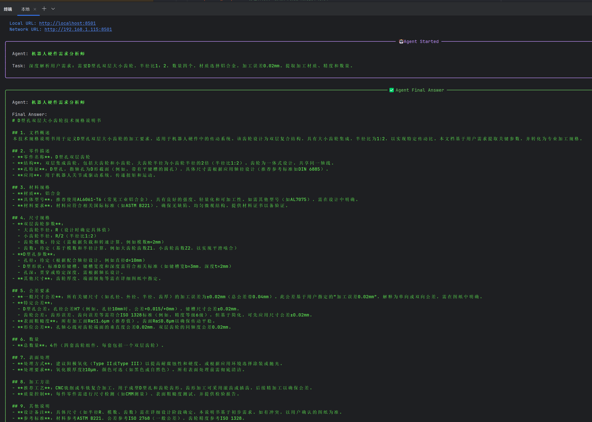
  <br>
  <sub><b>图注：机器人硬件需求分析师 - 正在进行需求参数化建模</b></sub>
</div>

<br>

<div align="center">
  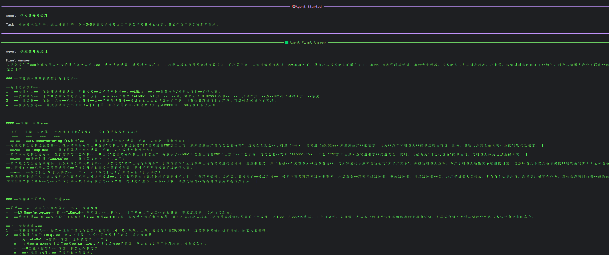
  <br>
  <sub><b>图注：供应链开发经理 - 正在检索匹配的加工厂家</b></sub>
</div>

<br>

<div align="center">
  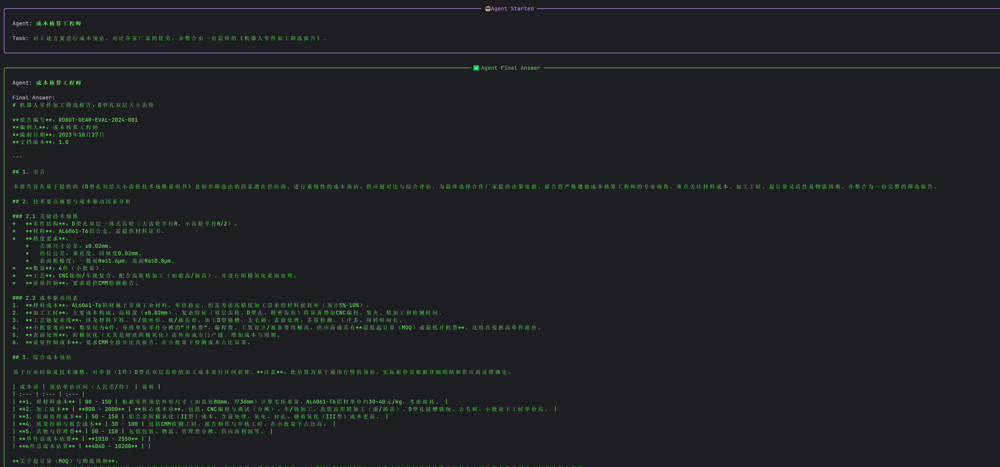
  <br>
  <sub><b>图注：成本核算工程师 - 正在进行多维度成本对标</b></sub>
</div>

### 📍 v1.0 可视化界面
<div align="center">
  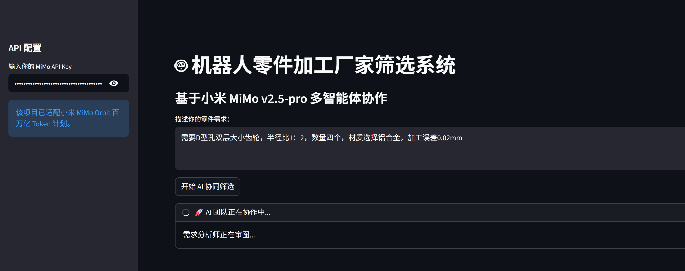
  <br>
  <sub><b>图注：主页</b></sub>
</div>

<br>

<div align="center">
  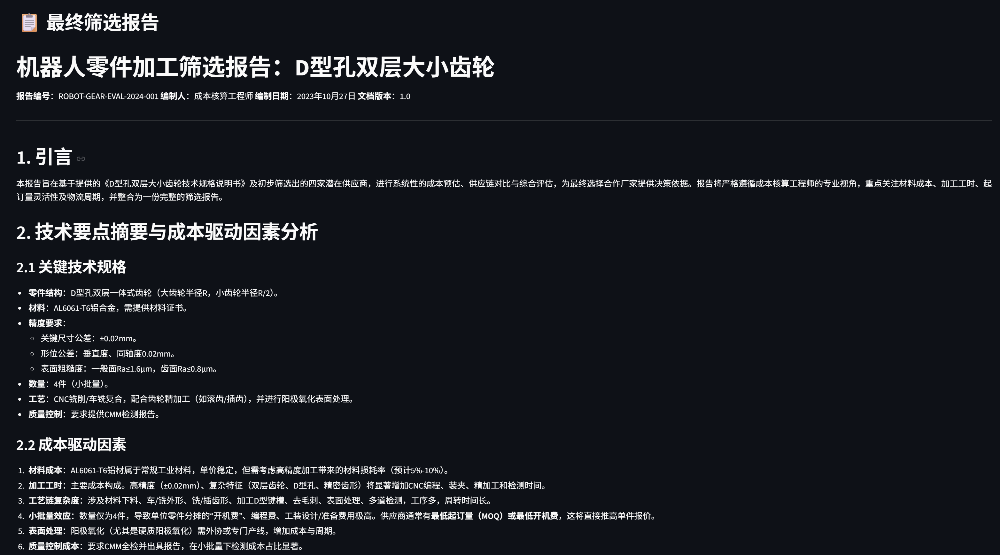
  <br>
  <sub><b>图注：引言，技术要点摘要</b></sub>
</div>

<br>

<div align="center">
  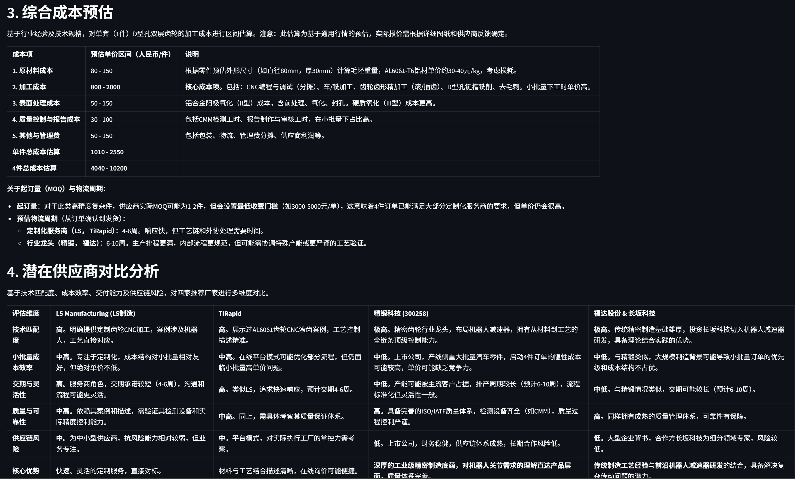
  <br>
  <sub><b>图注：总和成本预估和潜在供应商对比</b></sub>
</div>

<br>

<div align="center">
  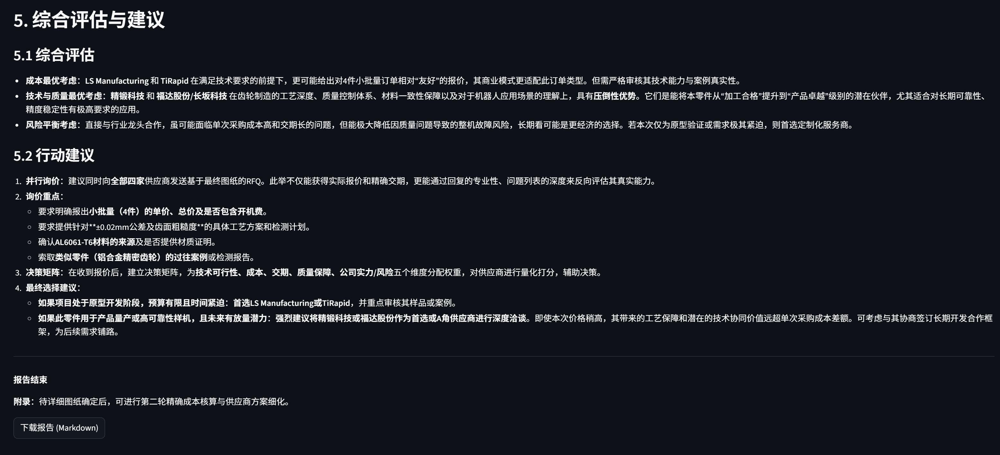
  <br>
  <sub><b>图注：综合评估与建议</b></sub>
</div>

### 📍 v2.0：视觉识别与决策闭环 (Current)
为了更贴合真实的工业场景，我们引入了多模态视觉能力与本地化管理功能。

#### 1️⃣ 视觉解析图纸 (Vision Insight)
接入 `mimo-v2-omni` 模型。用户只需上传 **PNG/JPG** 格式的机械图纸，系统即可自动提取公差、材质、表面处理等关键参数，并自动增强文字描述。

#### 2️⃣ 历史报告管理 (History Archive)
系统会自动将每一次筛选结果保存为本地 Markdown 文件。用户可以通过左侧边栏实时回溯历史方案，形成企业的“供应商决策库”。

**新版控制台展示：**

<div align="center">
  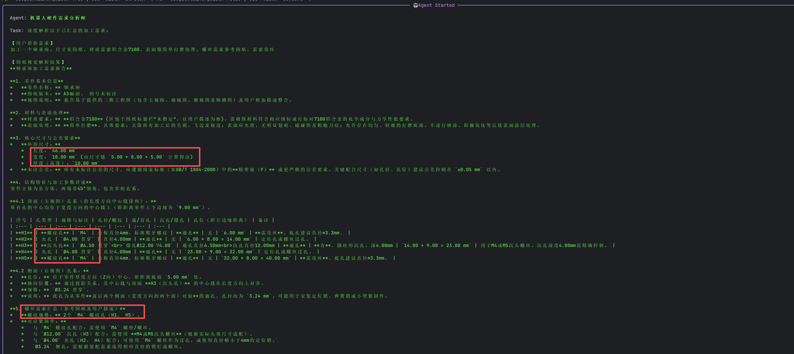
  <br>
  <sub><b>图注：引入视觉模型并成功提取有效信息</b></sub>
</div>

<br>

<div align="center">
  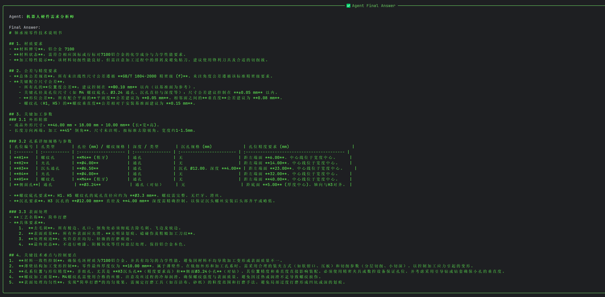
  <br>
  <sub><b>图注：针对分析内容对零件参数进行整合</b></sub>
</div>

**新版界面演示：**

<div align="center">
  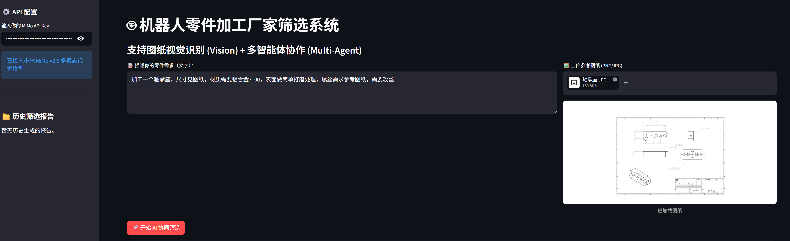
  <br>
  <sub><b>图注：新版主页，支撑上传图纸</b></sub>
</div>

<br>

<div align="center">
  
  <br>
  <sub><b>图注：工作流可视化，加入视觉模型分析功能</b></sub>
</div>

<br>

<div align="center">
  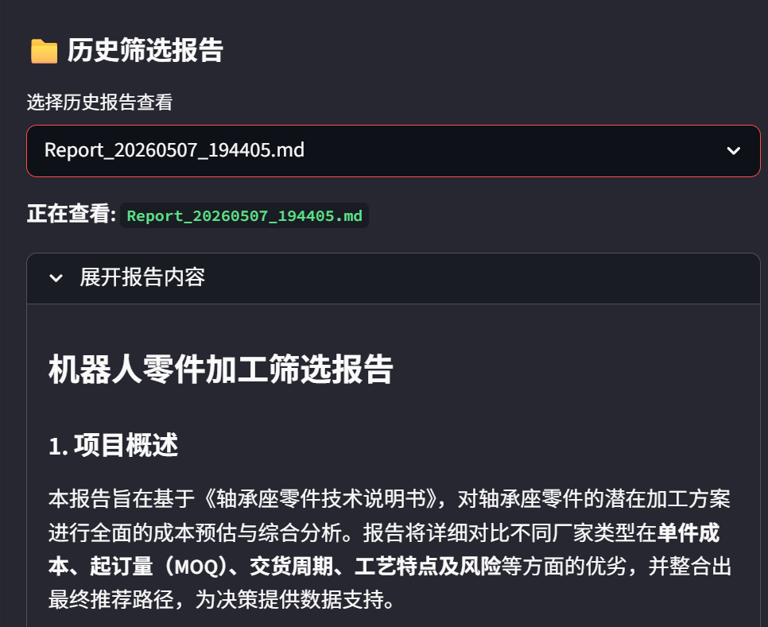
  <br>
  <sub><b>图注：选择历史分析报告（Markdown格式）并查看</b></sub>
</div>

<br>


## 🛠️ 技术栈
*   **核心模型**：Xiaomi MiMo v2.5-pro / MiMo-v2-omni
*   **Agent 框架**：CrewAI
*   **Web 框架**：Streamlit
*   **多模态处理**：Base64 Image Encoding & MiMo Vision API

---

## 📦 快速开始

1. **安装依赖**：
   ```bash
   pip install crewai streamlit openai
